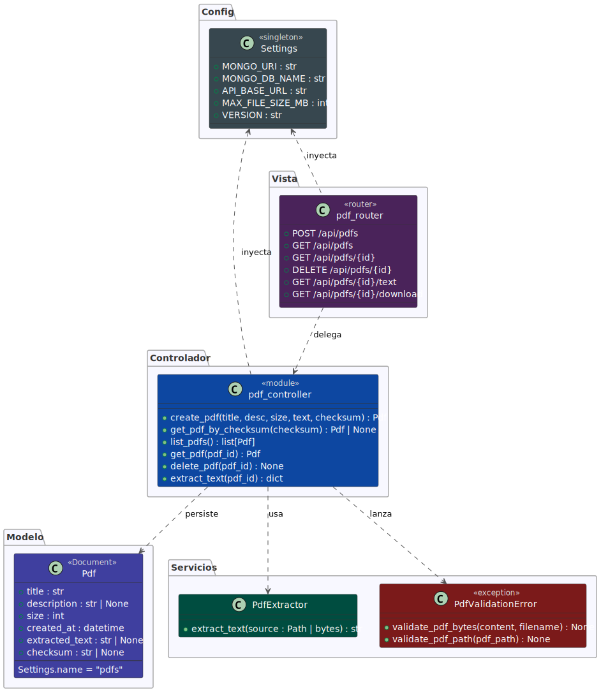

# pdf-extractext

## Integrantes

- **Tomás Faure  | 10823**
- **José Morata  | 10877**
- **Braian Rojas | 10922**

## Descripción

**pdf-extractext** es una herramienta orientada a la extracción de texto desde documentos PDF utilizando técnicas de procesamiento y automatización.

El objetivo principal del proyecto es facilitar la obtención de información textual desde archivos PDF para su posterior análisis, almacenamiento o procesamiento mediante herramientas de inteligencia artificial.

Este proyecto busca resolver problemas comunes como:

- Extraer texto estructurado desde documentos PDF
- Automatizar el procesamiento de documentos
- Preparar datos para pipelines de análisis o IA
- Integrar extracción de información con bases de datos

---

## Requisitos previos

- Python 3.12
- uv
- Docker

---

## Instalación

```bash
sudo rm -rf .venv # Recomendado
uv venv --python 3.12
uv sync
```

---

### Levantar el proyecto

#### 1. Levantar y crear contenedor

```bash
# Construye e inicia en segundo plano (detached)
docker compose -f .devcontainer/docker-compose.yml up -d --build
```

#### 2. Bajar el contenedor

```bash
# Detiene los servicios sin borrarlos.
docker compose -f .devcontainer/docker-compose.yml stop

# Borra contenedores, mantiene volúmenes de datos.
docker compose -f .devcontainer/docker-compose.yml down

# Esto borra los datos de la base de datos y el contenedor.
docker compose -f .devcontainer/docker-compose.yml down -v
```

#### 3. Levantar el contenedor ya creado

```bash
# En caso de que se haya eliminado el contenedor o eliminado. 
docker compose -f .devcontainer/docker-compose.yml up -d

# Fuerza a no usar cache o verificar contenedores anteriores y inicar de 0.
docker compose -f .devcontainer/docker-compose.yml up -d --build

# En caso de que el contenedor este guardado.
docker compose -f .devcontainer/docker-compose.yml start
```

---

## Uso de de la herramienta

Una vez levantado docker y sincronizado uv se puede usar directamente con: `fast-pdf <comando>` en caso
de que falle, se puede usar `uv run fast-pdf <comando>` para minimizar errores. Se puede usar `fast-pdf -h` para ayuda.

### Comandos

```bash
Comandos:

  # Sube un archivo PDF al servidor.
  upload <direccion_archivo>

  # Lista todos los documentos PDF persistidos.
  list

  # Muestra el texto extraído de un PDF por consola.
  get <id_pdf>

  # Elimina un documento PDF del servidor. 
  delete <id_pdf>

  # Descarga el texto extraído de un PDF como archivo .txt
  download <id_pdf>

Flags:

  -h --help
  
  # Usando en download permite renombrar el archivo de salida.
  --output <nombre_archivo.txt> 

```

---

## Arquitectura

El proyecto sigue una arquitectura basada en **3 capas**, lo que permite separar responsabilidades y facilitar el mantenimiento.

### 1. Capa de Presentación

Encargada de la interacción con el usuario o sistema externo.

Responsabilidades:

- Recibir archivos PDF
- Iniciar el proceso de extracción
- Mostrar resultados o exportarlos

---

### 2. Capa de Lógica de Negocio

Contiene la lógica principal del sistema.

Responsabilidades:

- Procesamiento del PDF
- Extracción de texto
- Integración con herramientas de IA
- Transformación y limpieza de datos

---

### 3. Capa de Datos

Encargada del almacenamiento y persistencia.

Responsabilidades:

- Guardar texto extraído
- Conectar con bases de datos
- Manejo de almacenamiento estructurado

En este proyecto se utiliza **MongoDB** como sistema de almacenamiento.

---

## Estructura del Proyecto

A continuación se describe la estructura principal del repositorio:

| Carpeta / Archivo | Descripción                              |
|-------------------|------------------------------------------|
| `dev/`            | Código fuente principal del proyecto     |
| `tests/`          | Pruebas automatizadas del sistema        |
| `upload/`         | Carpeta de pruebas                       |
| `docs/`           | Diagramas y otros documentos             |
| `README.md`       | Documentación principal del repositorio  |
| `pyproject.toml`  | Dependencias del proyecto                |
| `.gitignore`      | Archivos ignorados por Git               |
| `.devcontainer/`  | Configuracion para lanzar contenedor     |

Esta organización permite mantener una separación clara entre código, pruebas y documentación.

---

## Diagramas UML

### Infograma

Por completar :p

### Diagrama de Clases



> Un diagrama de clases en Lenguaje Unificado de Modelado (UML) es un tipo de diagrama de estructura estática que describe la estructura de un sistema mostrando las clases del sistema, sus atributos, operaciones (o métodos), y las relaciones entre los objetos.

### Diagrama de Secuencia

Por completar :p

---

## Tecnologías Utilizadas

El proyecto utiliza diversas tecnologías para el procesamiento y análisis de documentos:

- **Python**
  Lenguaje principal de desarrollo.
- **UV**
  Herramienta moderna para la gestión de dependencias y entornos Python.
- **Inteligencia Artificial (IA)**
  Utilizada para análisis avanzado del contenido extraído.
- **OpenCode**
  Herramienta utilizada dentro del flujo de desarrollo.
- **MongoDB**
  Base de datos NoSQL utilizada para almacenar la información extraída.

---

## Metodologías y Principios Aplicados

El proyecto sigue varias metodologías y principios de ingeniería de software para mejorar la calidad del código.

### TDD (Test Driven Development)

El desarrollo se basa en la creación de pruebas antes de implementar la funcionalidad. Esto permite:

- mejorar la calidad del código
- detectar errores temprano
- facilitar refactorizaciones

---

### 12-Factor App

Se aplican principios del modelo **12 Factor App**, orientados a construir aplicaciones escalables y mantenibles.

Algunos principios aplicados incluyen:

- configuración mediante variables de entorno
- separación entre código y configuración
- procesos stateless

---

### Principios de Desarrollo

El proyecto también sigue principios clásicos de diseño de software:

**KISS (Keep It Simple, Stupid)**
Mantener el código simple y fácil de entender.

**DRY (Don't Repeat Yourself)**
Evitar duplicación de lógica en el código.

**YAGNI (You Aren't Gonna Need It)**
Implementar solo lo necesario.

**SOLID**
Conjunto de principios para diseño orientado a objetos que mejora la mantenibilidad del software.

---

## Objetivo del Proyecto

El objetivo es construir una herramienta robusta y extensible para el procesamiento automático de documentos PDF dentro de pipelines de datos y sistemas de inteligencia artificial.
