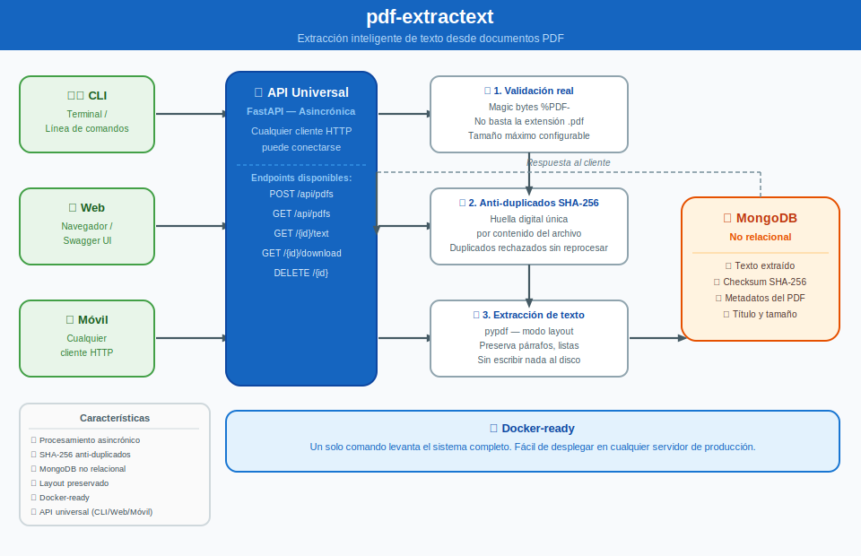
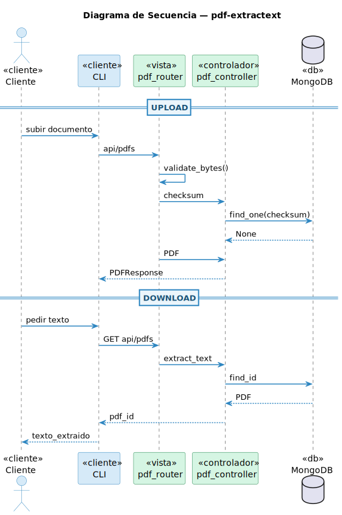

# pdf-extractext

## Integrantes

- **Tomás Faure  | 10823**
- **José Morata  | 10877**
- **Braian Rojas | 10922**

## Descripción

**pdf-extractext** es una herramienta orientada a la extracción de texto desde documentos PDF utilizando técnicas de procesamiento y automatización.

El objetivo principal del proyecto es facilitar la obtención de información textual desde archivos PDF para su posterior análisis, almacenamiento o procesamiento mediante herramientas de inteligencia artificial.

Este proyecto busca resolver problemas comunes como:

- Extraer texto estructurado desde documentos PDF
- Automatizar el procesamiento de documentos
- Preparar datos para pipelines de análisis o IA
- Integrar extracción de información con bases de datos

---

## Requisitos previos

- **Docker** y **Docker Compose** (Instalados y activos en el sistema).
- *Python 3.12* y *uv* (Opcional, únicamente si se desea ejecutar el servidor de forma nativa sin usar contenedores).

---

## Configuración Inicial

Antes de levantar cualquiera de los entornos, es indispensable generar el archivo de configuración de entorno local. En la raíz del proyecto, ejecute:

```bash
cp .env.example .env
```

> 💡 **Nota:** Abra el archivo `.env` recién creado y configure las variables correspondientes. Preste especial atención a `MONGO_URI` y `API_BASE_URL` según el entorno que vaya a iniciar.

## Modos de Ejecución del Proyecto

El despliegue de la aplicación está diseñado bajo un principio de desacoplamiento de infraestructura. Cuenta con dos flujos independientes según el caso de uso:

### Opción A: Modo Desarrollo (Ecosistema Completo Local)

*Ideal para el equipo de desarrollo, pruebas locales o evaluación académica.*

Este comando levanta tanto la API de FastAPI como un contenedor local y aislado de **MongoDB 7**, configurando un volumen de persistencia automático y un sistema de control de arranque (*healthcheck*) para asegurar que la API no inicie hasta que la base de datos esté lista:

```bash
docker compose -f docker-compose.yml -f docker-compose.dev.yml up -d --build
```

### Opción B: Modo Producción / Entrega al Cliente (Solo la API)

*Ideal para el despliegue final en la infraestructura del cliente.*

Si el cliente ya cuenta con su propio clúster de base de datos administrado (local o en la nube), no requiere contenedores de bases de datos redundantes. Asegúrese de colocar la dirección de su base de datos externa en la variable `MONGO_URI` del `.env` y ejecute:

```bash
docker compose up -d --build
```

Esto compilará y empaquetará el código fuente de forma estática bajo la imagen inmutable `parse-documents-fast:1.0.0` y levantará **únicamente el servicio de la API** corriendo de forma segura bajo un usuario sin privilegios (`appuser`).

### Gestión y Control de Servicios

Para administrar el ciclo de vida de los contenedores según el modo en el que los haya iniciado, utilice los siguientes comandos:

#### 1. Detener los servicios

Detiene la ejecución del servidor sin eliminar los contenedores de la memoria del sistema:

```bash

docker compose stop
```

#### 2. Apagar y limpiar el entorno

Remueve los contenedores de la memoria RAM del sistema de forma segura (los datos de la base de datos no se perderán gracias a los volúmenes):

```bash

# Si los levantó en Modo Producción:
docker compose down

# Si los levantó en Modo Desarrollo:
docker compose -f docker-compose.yml -f docker-compose.dev.yml down
```

#### 3. Ver registros (Logs) en tiempo real

Si necesita monitorear las peticiones HTTP entrantes o depurar errores internos de la API FastAPI:

```bash
docker compose logs -f app
```

#### 4. Limpieza total de base de datos (Solo Desarrollo)

Si durante la etapa de pruebas requiere eliminar por completo la base de datos local y los volúmenes de almacenamiento para iniciar un entorno limpio desde cero:

```bash
docker compose -f docker-compose.yml -f docker-compose.dev.yml down -v
```

---

## Uso de de la herramienta

Una vez levantado docker y sincronizado uv se puede usar directamente con: `fast-pdf <comando>` en caso
de que falle, se puede usar `uv run fast-pdf <comando>` para minimizar errores. Se puede usar `fast-pdf -h` para ayuda.

### Comandos

```bash
Comandos:

  # Sube un archivo PDF al servidor.
  upload <direccion_archivo>

  # Lista todos los documentos PDF persistidos.
  list

  # Muestra el texto extraído de un PDF por consola.
  get <id_pdf>

  # Elimina un documento PDF del servidor. 
  delete <id_pdf>

  # Descarga el texto extraído de un PDF como archivo .txt
  download <id_pdf>

Flags:

  -h --help
  
  # Usando en download permite renombrar el archivo de salida.
  --output <nombre_archivo.txt> 

```

---

## Arquitectura

El proyecto sigue una arquitectura basada en **3 capas**, lo que permite separar responsabilidades y facilitar el mantenimiento.

### 1. Capa de Presentación

Encargada de la interacción con el usuario o sistema externo.

Responsabilidades:

- Recibir archivos PDF
- Iniciar el proceso de extracción
- Mostrar resultados o exportarlos

---

### 2. Capa de Lógica de Negocio

Contiene la lógica principal del sistema.

Responsabilidades:

- Procesamiento del PDF
- Extracción de texto
- Integración con herramientas de IA
- Transformación y limpieza de datos

---

### 3. Capa de Datos

Encargada del almacenamiento y persistencia.

Responsabilidades:

- Guardar texto extraído
- Conectar con bases de datos
- Manejo de almacenamiento estructurado

En este proyecto se utiliza **MongoDB** como sistema de almacenamiento.

---

## Estructura del Proyecto

A continuación se describe la estructura principal del repositorio:

| Carpeta / Archivo | Descripción                              |
|-------------------|------------------------------------------|
| `dev/`            | Código fuente principal del proyecto     |
| `tests/`          | Pruebas automatizadas del sistema        |
| `upload/`         | Carpeta de pruebas                       |
| `docs/`           | Diagramas y otros documentos             |
| `README.md`       | Documentación principal del repositorio  |
| `pyproject.toml`  | Dependencias del proyecto                |
| `.gitignore`      | Archivos ignorados por Git               |
| `.devcontainer/`  | Configuracion para lanzar contenedor     |

Esta organización permite mantener una separación clara entre código, pruebas y documentación.

---

## Diagramas UML

### Infograma



> Una vista general del sistema en lenguaje no técnico: qué hace,
> cómo fluye la información y desde dónde se puede usar.

### Diagrama de Clases


> Un diagrama de clases en Lenguaje Unificado de Modelado (UML) es un tipo de diagrama de estructura estática que describe la estructura de un sistema mostrando las clases del sistema, sus atributos, operaciones (o métodos), y las relaciones entre los objetos.

### Diagrama de Secuencia



>Un diagrama de secuencia muestra cómo interactúan los componentes de un sistema en orden cronológico, representando el flujo de mensajes entre participantes para ilustrar un proceso específico.

---

## Tecnologías Utilizadas

El proyecto utiliza diversas tecnologías para el procesamiento y análisis de documentos:

- **Python**
  Lenguaje principal de desarrollo.
- **UV**
  Herramienta moderna para la gestión de dependencias y entornos Python.
- **Inteligencia Artificial (IA)**
  Utilizada para análisis avanzado del contenido extraído.
- **OpenCode**
  Herramienta utilizada dentro del flujo de desarrollo.
- **MongoDB**
  Base de datos NoSQL utilizada para almacenar la información extraída.

---

## Metodologías y Principios Aplicados

El proyecto sigue varias metodologías y principios de ingeniería de software para mejorar la calidad del código.

### TDD (Test Driven Development)

El desarrollo se basa en la creación de pruebas antes de implementar la funcionalidad. Esto permite:

- mejorar la calidad del código
- detectar errores temprano
- facilitar refactorizaciones

---

### 12-Factor App

Se aplican principios del modelo **12 Factor App**, orientados a construir aplicaciones escalables y mantenibles.

Algunos principios aplicados incluyen:

- configuración mediante variables de entorno
- separación entre código y configuración
- procesos stateless

---

### Principios de Desarrollo

El proyecto también sigue principios clásicos de diseño de software:

**KISS (Keep It Simple, Stupid)**
Mantener el código simple y fácil de entender.

**DRY (Don't Repeat Yourself)**
Evitar duplicación de lógica en el código.

**YAGNI (You Aren't Gonna Need It)**
Implementar solo lo necesario.

**SOLID**
Conjunto de principios para diseño orientado a objetos que mejora la mantenibilidad del software.

---

## Objetivo del Proyecto

El objetivo es construir una herramienta robusta y extensible para el procesamiento automático de documentos PDF dentro de pipelines de datos y sistemas de inteligencia artificial.
